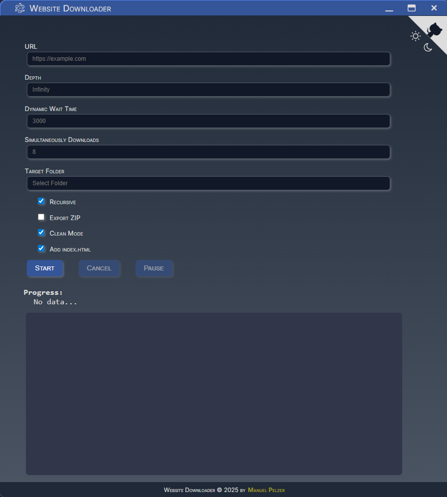

#  Website-Downloader
A fast and universal downloader for dynamic websites, created with Puppeteer and Electron.

## Features
- 🔎 Dynamic Loading: Catches files that are dynamically loaded during runtime.
- 🚀 Fast Loading: Up to 25 files are downloaded simultaneously.
- 🔁 Recursive Download: Searches linked pages and downloads files found there.
- 📏 Limit Depth: Specifies how deep links should be traced.
- 🧹 Cleanup Mode: Empties the destination folder before saving downloads.
- 🗺️ Sitemap Export: Exports a sitemap of the downloaded website.
- 🪵 Log Export: Exports a log with any error messages.
- 📦 ZIP Export: Creates a ZIP archive containing the entire website after downloads are complete.
- 🔧 Progress Status: Displays the current status of the download process.
- 💻 GUI or CLI usage.
- 🌐 Offline support: Adapts all links inside the HTML files, so the website can be used offline.
- 🌓 Supports Light Mode and Dark Mode

## Installation
Since I am pure windows user, I can describe the steps only for windows machines. The steps are the same for users of other systems. At least up to `npm install`. From there you can run the Downloader with `npm start` and it will work.
The steps after that are windows specific: A package is created (which runs the tool as .exe file) and a windows installer (to... guess what... install it on a windows machine). 
But I am sure, for Linux and MacOS it will also be possible, to do it in a simmilar way.

I assume you have node.js, npm and git already installed.
First, clone the repository and install the dependencies:
```cmd
git clone https://github.com/ManuelPeh76/website-downloader.git

cd website-downloader

npm install
```
Now you can run the app with `npm start`. But it still needs the cmd window to be open. To make the app really standalone (without the need to run a second window beside it), you can create an app package:
```cmd
npm run build
```
This creates a 'dist\website-downloader-win32-x64' folder, containing the app as an .exe file.
Just step inside and start website-downloader.exe.

## Build a Windows Installer (optional)
```cmd
npm run setup
```
Thist creates a windows installer package from the app. When you start the exe file inside the dist/installers folder, please wait until the setup is finished completely (the icon in mid screen disappears), even if the app starts while the install process is still going. After installation is complete, the app will be restarted (would be unfortunally, if you'd already download anything ;) ).
The setup should place a shortcut to start the Website Downloader inside of the start menu. The app will be installed to `C:\Users\<username>\AppData\Local\website_downloader`.

## Usage
#### GUI


  1. Start the GUI with the shortcut from the startmenu or go to 
  C:\Users\<username>\AppData\Local\website_downloader and start the Website-Downloader.exe
  2. Enter the URL of the website you want to download.
  3. Select the desired options.
  4. Choose the target folder, in which the website folder will be created.
  5. Start the download with the `Start` button.

#### CLI
 Open a command line inside the repo folder and start the tool with
 ```cmd
 node src/download <url> [options]
 ```

#### Options
| Option | Description |
| --- | --- |
| `-d=<number>`, `--depth=<number>` | The depth of links to consider (default: infinity). |
| `-dwt=<ms>`, `--dyn_wait_time=<ms>` | The time in ms the tool waits for dynamic content to load after the page is loaded (default 3000). |
| `-r`, `--recursive` | Enables recursive downloading of linked pages (default: true). |
| `-z`, `--zip` | Creates a ZIP archive after downloads are complete (default: false). |
| `-c`, `--clean` | Empties the destination folder before saving downloads (default: false). |
| `-o=<path>`, `--outdir=<path>` | The full path to the folder the website is saved to (default: repo folder). |
| `-s=<number>`, `--simultaneous=<number>` | The amount of simultaneously active downloads (default: 8). |
| `-u`, `--use-index` | If there's no file ending in the path, the filename 'index.html' is assumed. (default: true) |

## Example
To download a web page with a link depth of 4, recursion, clean mode, a dynamic wait time of 500ms, using index.html option and with output on the desktop use the following command:
```cmd
node src/download https://example.org -r -c -u -d=4 -dwt=500 -o=C:\Users\<username>\Desktop
```

## Some Infos about this Tool

- Files that are dynamically loaded during the website's runtime are only recorded if the request occurs within the dynamical wait time (3000ms by default) after opening the page.
- CSS files (whether linked or dynamically loaded) are searched for 'url(...)' to include fonts and images that are loaded by the CSS.
- Only files whose storage location matches that of the website are saved.
- When an HTML file has been downloaded, the tool adapts all links to make sure, the webpage works offline.
- When using the GUI, all settings you change (incl. the url) are saved via local storage. The next time you start the GUI your own settings will be restored.

## License
This project is licensed under the [MIT License](https://opensource.org/licenses/MIT).

---


