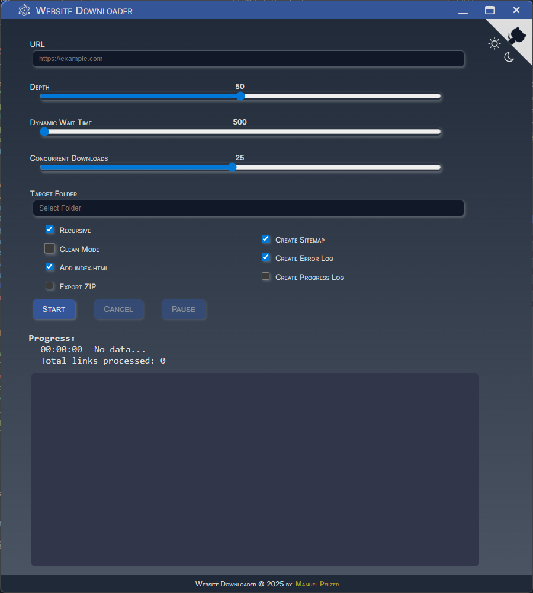

[](https://www.javascript.com/)


[](https://github.com/ManuelPeh76/Website-Downloader/stargazers)
[](https://github.com/ManuelPeh76/Website-Downloader/blob/master/LICENSE)
#  Website Downloader
[Features](#features) | [Installation](#installation) | [Usage](#usage) | [GUI](#gui) | [CLI](#cli) | [Example](#example) | [Enhancements](#enhancements-since-the-first-version)

Website Downloader is a powerful tool for downloading entire websites, including all resources, for offline use. It supports modern web technologies and has been continuously enhanced to ensure that all relevant assets for a page are stored locally.

While working with existing website downloaders, it became clear that many tools struggle to create a functioning local copy of websites with dynamically loaded content.

This app was developed to address this weakness in static website downloaders: Correctly downloading pages with dynamically loaded content and active web app features. Thanks to intelligent processing of dynamically loaded assets, this tool enables the creation of fully functional local copies of complex websites.

**NOTE**: Websites and Web-Apps can be quite complex and this App is no magician. Some very specific dynamic content (e.g., after clicks, mouseovers) may not be automatically recognized.

<a name="features"></a>
# ⚙️ Features
- **Complete Website Download:** Loads HTML pages and all resources referenced within them (images, CSS, JS, fonts, videos, etc.).
- **Recursive Depth-First Search:** Optionally, pages linked at any depth can be downloaded.
- **Dynamic Content:** Detects and loads content that was dynamically loaded via XHR/Fetch-API.
- **Manifest.json Support:** Detects and processes web app manifest files (`manifest.json`) and loads icons, start URLs, and splash screens referenced from them.
- **Intelligent Asset Detection:** Extracts resources from HTML, CSS (`url(...)` and `@import`), meta tags (e.g., OpenGraph, Twitter), link tags (icons, Apple Touch Icons, manifest), srcset, poster, etc.
- **Index.html Support:** Optional automatic renaming of link targets without file extensions to `index.html` for reliable offline functionallity.
- **Error and Progress Logging:** Progress, errors, and download lists are logged; can optionally be saved as a file.
- **ZIP Export:** Optionally, a ZIP archive of the entire site can be created upon completion.
- **Sitemap Export:** Optionally, a sitemap.json file with all downloaded pages and assets is created.
- **Folder Cleanup:** The target folder can be emptied before downloading.
- **Concurrency:** Adjustable number of parallel downloads.
- **Adjustable wait time for dynamic content**: Time delay ('Dynamic Wait Time' - dwt) after HTML parsing to capture files that are dynamically loaded during runtime.
- **History function for input fields:**
  - **What is it?** The text input fields `URL` and `Target Folder` remember previous entries.
  - **How ​​does it work?** You can navigate through the history using the `[Arrow Up]`/`[Arrow Down]` keys; `[Delete]` deletes an entry.
  - The history is saved for each field in `localStorage` and automatically restored at startup.
  - Implemented via a custom, robust `History` class in the GUI (`renderer.js`).

<a name="installation"></a>
# 💻 Installation
I assume you have node.js, npm and git already installed.
First, clone the repository (or download the ZIP file) and install the dependencies:
```cmd
git clone https://github.com/ManuelPeh76/website-downloader.git

cd website-downloader

npm install
```
Now you can run the app with `npm start`.
With `npm run dev` the app works exactly the same as if you started it with `npm start`, but it restarts automatically each time one of its files change.

To use this tool as a real standalone app, you have to create an app package. This works for windows users only:
```cmd
npm run build
```
This creates the app in `.\dist\website-downloader-win32-x64`, containing the app as an .exe file.
Just step inside and start `website-downloader.exe`.

## ⚒️ Build a Windows Installer
```cmd
npm run setup
```
Thist creates a windows installer package from the app. When you start the .exe (or .msi) file inside the `.\dist\installers` folder, please wait until the setup is finished completely (the icon in mid screen disappears), even if the app starts while the install process is still going. After installation is complete, the app will be restarted (would be unfortunally, if you'd already download anything ;) ).<br>
The app will be installed to `C:\Users\<username>\AppData\Local\website_downloader`.

<a name="usage"></a>
# 🪛 Usage

## GUI


1. **If you used the installer**:<br>&nbsp;&nbsp;Go to `C:\Users\<username>\AppData\Local\website_downloader`<br>&nbsp;&nbsp;and start the `website-downloader.exe` (or create a desktop shortcut to start it from the desktop).<br>
**If you want to start it from the repo folder**:<br>&nbsp;&nbsp;Go inside it and open a cmd window by typing `cmd` into the addressbar.<br>&nbsp;&nbsp;There you start it with `npm start` or `npm run dev`.
2. **Specify URL and target folder**:<br>
Specify the website address and the local target folder. These fields have a history for easy reuse. Type in the target folder manually, or double click into the text field to open a folder selection dialogue. <br>NOTE: You may omit the 'http://' or 'https://' in the URL. The app adds it by itself.
3. **Select options**:<br>
Depth, Recursive, ZIP, Sitemap, Error Log, index.html, Clean Folder, Concurrency, DWT...
4. **Start download**:<br>
One click downloads the entire page (including dynamically loaded content and all assets) to the target folder.
5. **Monitor progress and errors**:<br>
Progress is displayed and can be saved as a file (if the corresponding checkbox is checked).
6. **Optional ZIP/Sitemap export:**<br>
After downloading, the data can be saved as a ZIP archive and/or sitemap (if the corresponding checkbox is checked).

### Keyboard Shortcuts

| Key | Action | Condition |
| --- | --- | --- |
| Tab | Cycle down through the input elements | Idle |
| Shift + Tab | Cycle up through the input elements | Idle |
| Enter | Start Download | Idle |
| Esc | Remove focus from input elements | Idle |
| Arrow Up,<br>Arrow Down | Navigate through history<br>(text input fields only) | Idle
| Delete | Remove entry from history<br>(text input fields only) | Idle |
| Esc | Abort Download | Downloading |
| p | Pause / Resume Download | Downloading |
| Ctrl + L | Light Mode | Always |
| Ctrl + D | Dark Mode | Always |

## CLI

 Open a command line inside the repo folder and start the tool with
 ```cmd
 node src/download <url> [options]
 ```

### Options
| Option | Description |
| --- | --- |
| `-d=<number>`<br>`--depth=<number>` | The depth of links to consider (default: 100). |
| `-dwt=<ms>`<br>`--dyn_wait_time=<ms>` | The time in ms the tool waits for dynamic content to load after the page is loaded (default 3000). |
| `-r`<br>`--recursive` | Enables recursive downloading of linked pages (default: true). |
| `-z`<br>`--zip` | Creates a ZIP archive after downloads are complete (default: false). |
| `-c`<br>`--clean` | Empties the destination folder before saving downloads (default: false). |
| `-f=<path>`<br>`--folder=<path>` | The full path to the folder the website is saved to (default: repo folder). |
| `-cc=<number>`<br>`--concurrency=<number>` | The amount of concurrent active downloads (default: 12). |
| `-u`<br>`--use-index` | If there's no file ending in the path, the filename 'index.html' is assumed. (default: true) |

### Example
To download a web page with a link depth of 4, recursion, clean mode, a dynamic wait time of 500ms, using index.html option and with output on the desktop use the following command:
```cmd
node src/download https://example.org -r -c -u -d=4 -dwt=500 folder=C:\Users\<username>\Desktop
```
<a name="enhancements-since-the-first-version"></a>
# 🚀 Enhancements since the first version
- **Manifest.json support**:<br> Automatic detection and download of all icons, start URLs, and splash screens referenced in the manifest.
- **History for input fields**:<br> Convenient, persistent history for the `URL` and `Target Folder` text fields, keyboard navigation.
- **Better asset detection**:<br> Meta tags, srcset, link tags, etc. are now fully considered.
- **Fine-grained logging options**: Progress, errors, and sitemap can be enabled/disabled.
- **Multiplatform GUI:** Electron frontend with theme switcher, tooltips, automatic settings saving function, and history.

<a name="technical-details"></a>
# 🔎 Technical Details
- Uses **Node.js** as backend and **Electron** as frontend
- Uses **Puppeteer** for true browser rendering (which is also one way to recognize dynamic content)
- **JSZip** for ZIP export
- **NTSuspend** provides an easy way to pause/resume the execution of scripts on windows machines

<a name="notes"></a>
# 🗺️ Notes
- For very large pages, a high `concurrency` value and sufficient memory are recommended.

- The core functionality (i.e. the CLI version) is written in pure JavaScript executed by Node.js. The only dependencies are Puppeteer and JSZip. No other dependencies, no frameworks or external apps.

- Some additional packages are needed for the GUI and to build the App:
  - NTSuspend
  - Electron
  - ElectronInstallerWindows
  - ElectronPackager
  - ElectronPrebuilt
  - Electronmon

# 📃 License
<span style="margin-left:25px">MIT license © 2025 Manuel Pelzer</span>

---
**Quellcode & weitere Infos:**
[GitHub: ManuelPeh76/Website-Downloader](https://github.com/ManuelPeh76/Website-Downloader)

