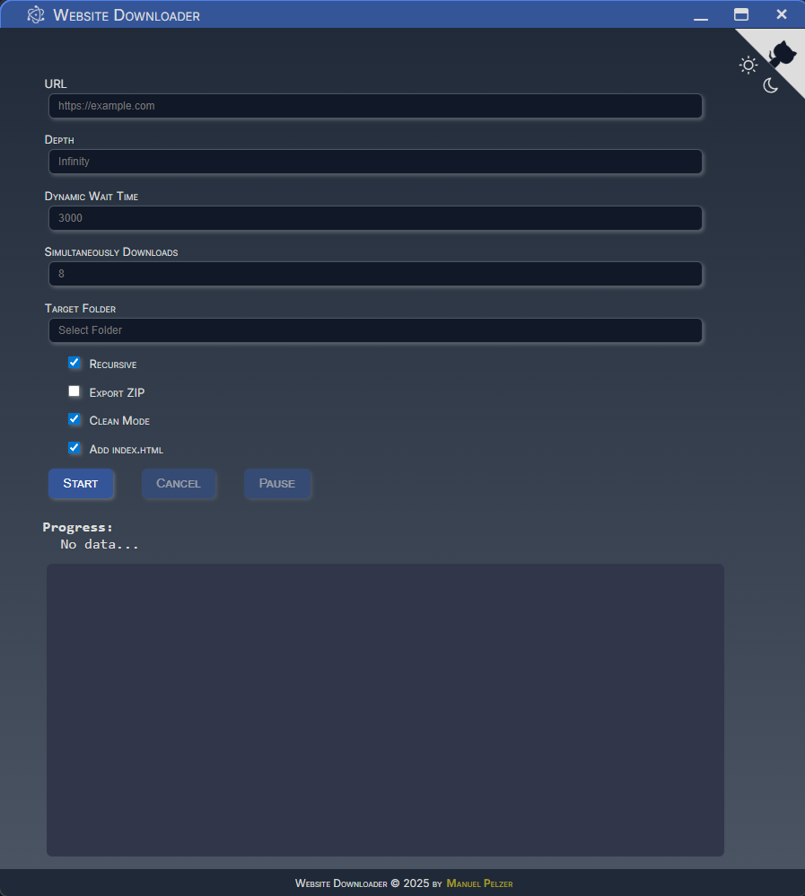
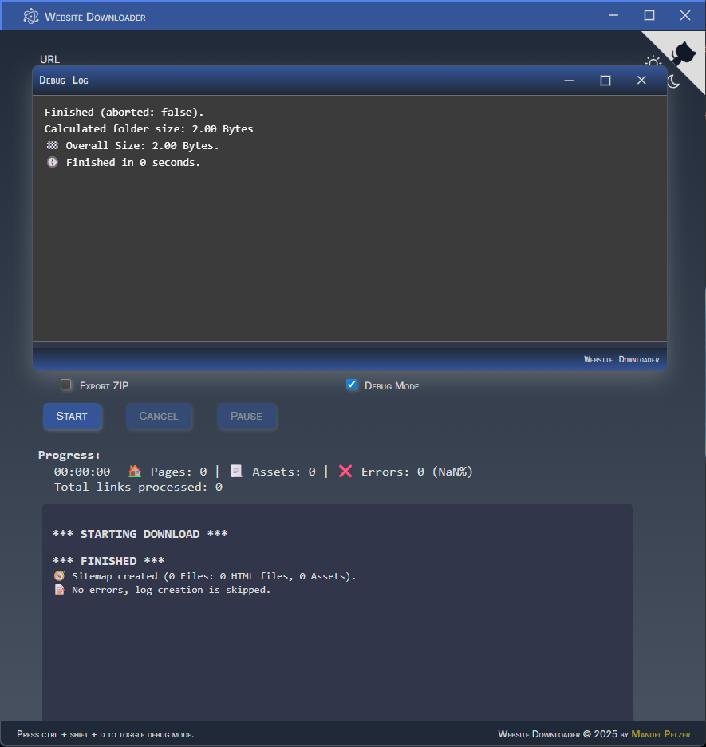
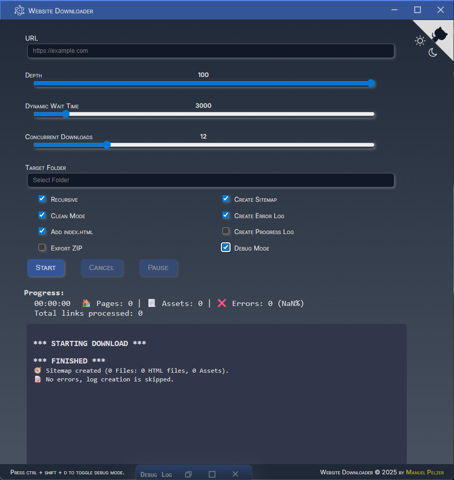
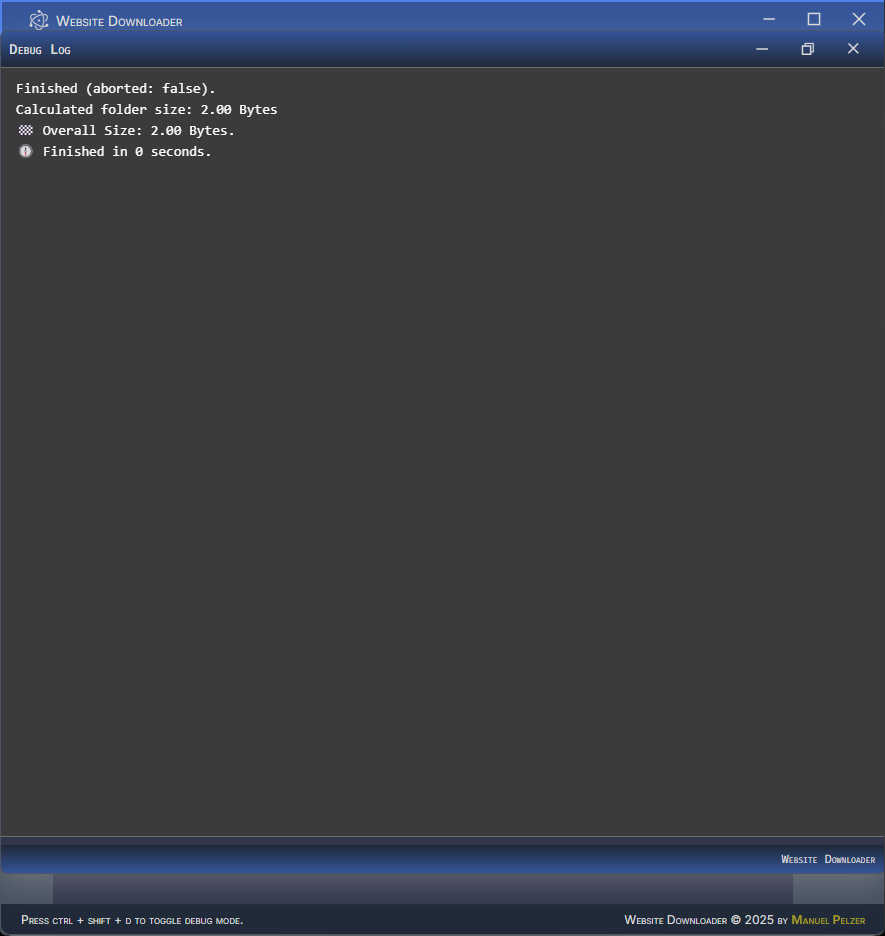

[](https://www.javascript.com/)


[](https://github.com/ManuelPeh76/Website-Downloader/stargazers)
[](https://github.com/ManuelPeh76/Website-Downloader/blob/master/LICENSE)
<center>

| [Funktionen](#features) | [Installation](#installation) | [Windows-Installer](#installer) | [Screenshots](#screenshots) | [GUI](#gui) | [CLI](#cli) | [Verbesserungen](#enhancements) | [Technische Details](#details) | [Hinweise](#notes) |

Website Downloader ist ein leistungsstarkes Tool, um komplette Webseiten inklusive aller Ressourcen für die Offline-Nutzung herunterzuladen. Es unterstützt moderne Web-Technologien und wurde laufend erweitert, damit wirklich alle für eine Seite relevanten Assets lokal gespeichert werden.

Bei der Arbeit mit bestehenden Website-Downloadern stellte sich heraus, dass viele Tools Schwierigkeiten haben, eine funktionierende lokale Kopie von Websites mit dynamisch geladenen Inhalten zu erstellen.

Diese App wurde entwickelt, um diese Schwachstelle statischer Website-Downloader zu beheben: das korrekte Herunterladen von Seiten mit dynamisch geladenen Inhalten und aktiven Web-App-Funktionen. Dank der intelligenten Verarbeitung dynamisch geladener Assets ermöglicht dieses Tool die Erstellung voll funktionsfähiger lokaler Kopien komplexer Websites.

**HINWEIS**: Websites und Web-Apps können sehr komplex sein, und diese App kann auch nicht zaubern. Einige sehr spezifische dynamische Inhalte (z. B. nach Klicks oder Mouseovers) werden möglicherweise nicht automatisch erkannt.

<a name="features"></a>
# ⚙️ Funktionen
- **Kompletter Website-Download:** Lädt HTML-Seiten und alle darin referenzierten Ressourcen (Bilder, CSS, JS, Schriftarten, Videos usw.).
- **Rekursive Tiefensuche:** Optional können verlinkte Seiten in beliebiger Tiefe heruntergeladen werden.
- **Dynamische Inhalte:** Erkennt und lädt Inhalte, die dynamisch über XHR/Fetch-API geladen wurden.
- **Manifest.json-Unterstützung:** Erkennt und verarbeitet Manifestdateien von Web-Apps (`manifest.json`) und lädt darin referenzierte Grafiken, Start-URLs und Splash-Screens.
- **Intelligente Asset-Erkennung:** Extrahiert Ressourcen aus HTML, CSS (`url(...)` und `@import`), Meta-Tags (z. B. OpenGraph, Twitter), Link-Tags (Grafiken, Apple Touch-Grafiken, Manifest), Srcset, Poster usw.
- **Index.html-Unterstützung:** Optionale automatische Umbenennung von Linkzielen ohne Dateierweiterung in `index.html` für zuverlässige Offline-Funktionalität.
- **Fehler- und Fortschrittsprotokollierung:** Fortschritt, Fehler und Downloadlisten werden protokolliert und können optional als Datei gespeichert werden.
- **ZIP-Export:** Optional kann nach Abschluss ein ZIP-Archiv der gesamten Site erstellt werden.
- **Sitemap-Export:** Optional wird eine sitemap.json-Datei mit allen heruntergeladenen Seiten und Assets erstellt.
- **Ordnerbereinigung:** Der Zielordner kann vor dem Download geleert werden.
- **Parallele Downloads:** Einstellbare Anzahl paralleler Downloads.
- **Einstellbare Wartezeit für dynamische Inhalte**: Zeitverzögerung ('Dynamic Wait Time' - dwt) nach dem HTML-Parsing, um Dateien zu erfassen, die während der Laufzeit dynamisch geladen werden.
- **History-Funktion für Eingabefelder:**
  - **Was ist das?** Die Texteingabefelder `URL` und `Zielordner` merken sich vorherige Eingaben.
  - **Wie funktioniert es?** Sie können mit den Tasten `[Pfeil hoch]`/`[Pfeil runter]` durch den Verlauf navigieren; `[Entf]` löscht einen Eintrag.
  - Der Verlauf wird für jedes Feld im `localStorage` gespeichert und beim Start automatisch wiederhergestellt.
  - Implementierung über eine benutzerdefinierte, robuste `History`-Klasse in der GUI (`renderer.js`).

<a name="installation"></a>
# 💻 Installation
Ich gehe davon aus, dass node.js, npm und git bereits installiert sind.
Klone zunächst das Repository (oder lade die ZIP-Datei herunter) und installiere die Dependencies:
```cmd
git clone https://github.com/ManuelPeh76/website-downloader.git
cd website-downloader
npm install
```
Jetzt kannst du die App mit `npm start` oder mit `npm run dev` starten.
Mit `npm run dev` funktioniert die App genauso, als ob sie mit `npm start` gestartet worden wäre, startet aber automatisch neu bei Datei-Änderungen.

Um dieses Tool als eigenständige App zu verwenden, muss ein App-Paket erstellt werden. Dies funktioniert nur für Windows-Benutzer:
```cmd
npm run build
```
Dadurch wird die App in `.\dist\website-downloader-win32-x64` erstellt und kann über die `website-downloader.exe` gestartet werden.

<a name="installer"></a>
## ⚒️ Windows-Installer erstellen
```cmd
npm run setup
npm run build
```
Dadurch wird ein Windows-Installer-Paket aus der App erstellt. Starte die EXE-Datei im Ordner `.\dist\installers` und warte, bis das Setup vollständig abgeschlossen ist (das Symbol in der Bildschirmmitte verschwindet), auch wenn die App bereits während des Installationsvorgangs startet. Nach Abschluss der Installation wird die App nämlich neu gestartet (wäre blöd, wenn bereits Downloads laufen würden ;)).<br>
Die App wird unter `C:\Benutzer\<Benutzername>\AppData\Local\website_downloader` installiert.

<a name="screenshots"></a>
# 🖥️ Screenshots

<table>
<tr><td valign=top>Website Downloader<br></td><td valign=top>Debug-Fenster geöffnet<br></td></tr>
<tr><td valign=top>Debug-Fenster minimiert<br></td><td valign=top>Debug-Fenster maximiert<br></td></tr>
</table>

# 🪛 Verwendung

## GUI


1. **App starten**
   - **Wenn das Installationsprogramm verwendet wurde**, gehe zu<br> `C:\Benutzer\<Benutzername>\AppData\Local\website_downloader`<br>&nbsp;&nbsp;und starte die Datei `website-downloader.exe` (oder erstelle eine Desktopverknüpfung, um sie vom Desktop aus zu starten).<br>
   - **Um das Tool im Repo-Ordner zu starten**:<br>&nbsp;&nbsp;Gehe in das Repository und öffne ein Eingabeaufforderungsfenster, indem du `cmd` in die Adressleiste eingibst.<br>&nbsp;&nbsp;Dort startest du das Tool mit `npm start` oder `npm run dev`.

2. **URL und Zielordner angeben**<br>
Gebe die Website-Adresse und den lokalen Zielordner an. Diese Felder verfügen über einen Verlauf/History zur einfachen Wiederverwendung. Gebe den Zielordner manuell ein oder doppelklicke in das Textfeld, um einen Ordnerauswahldialog zu öffnen. <br>HINWEIS: `http://` oder `https://` können in der URL weggelassen werden. Die App fügt das Protokoll automatisch hinzu.
3. **Optionen auswählen**<br>
Tiefe, Rekursion, ZIP, Sitemap, Fehlerprotokoll, index.html, Ordner bereinigen, Parallelität, DWT...
4. **Download starten**<br>
Ein Klick auf `Start` lädt die gesamte Seite (einschließlich dynamisch geladener Inhalte und aller Assets) in den Zielordner herunter.
5. **Fortschritt und Fehler überwachen**<br>
Der Fortschritt wird angezeigt und kann als Datei gespeichert werden (sofern die entsprechende Checkbox aktiviert ist).
6. **Optionaler ZIP-/Sitemap-Export**<br>
Nach dem Download kann ein ZIP-Archiv und/oder eine Sitemap erstelllt werden (sofern die entsprechende Checkbox aktiviert ist).

Um zu sehen, was im Hintergrund passiert, wurde ein Debug-Mode integriert. Drücke Strg+Umschalt+D, um die Debug-Checkbox anzuzeigen.
Wenn aktiviert, wird beim Start des Downloads ein kleines Zusatz-Fenster angezeigt mit vielen zusätzlichen Informationen.

### Tastaturkürzel

| Taste | Aktion | Bedingung |
| --- | --- | --- |
| Tab | Eingabeelemente nach unten durchgehen | Leerlauf |
| Umschalt + Tab | Eingabeelemente nach oben durchgehen | Leerlauf |
| Esc | Fokus von Eingabeelementen entfernen | Leerlauf |
Strg + Umschalt + D | Debug-Modus umschalten | Leerlauf |
| Pfeil hoch,<br>Pfeil runter | Verlauf durchsuchen<br>(nur Texteingabefelder) | Leerlauf
| Entf | Eintrag aus Verlauf entfernen<br>(nur Texteingabefelder) | Leerlauf |
| Eingabe | Download starten | Leerlauf |
| Esc | Download abbrechen | Download |
| P | Download pausieren/fortsetzen | Download |
| Strg + A | Aktive Handles anzeigen | Download + Debug-Modus |
| Strg + L | Heller Modus | Immer |
| Strg + D | Dunkler Modus | Immer |

## CLI

Öffne eine Kommandozeile im Repo-Ordner und starte das Tool mit
```cmd
node src/download <url> [Optionen]
```

### Optionen

| Option | Beschreibung |
| --- | --- |
| `-d=<Zahl>`<br>`--depth=<Zahl>` | Die Tiefe der zu berücksichtigenden Links (Standard: 100). |
| `-dwt=<ms>`<br>`--dyn_wait_time=<ms>` | Die Zeit in ms, die das Tool nach dem Laden der Seite auf das Laden dynamischer Inhalte wartet (Standard: 3000). |
| `-r`<br>`--recursive` | Aktiviert das rekursive Herunterladen verlinkter Seiten (Standard: true). |
| `-z`<br>`--zip` | Erstellt nach Abschluss der Downloads ein ZIP-Archiv (Standard: false). |
| `-c`<br>`--clean` | Leert den Zielordner vor dem Speichern von Downloads (Standard: false). |
| `-f=<Pfad>`<br>`--folder=<Pfad>` | Der vollständige Pfad zum Ordner, in dem die Website gespeichert wird (Standard: Repo-Ordner). |
| `-cc=<Zahl>`<br>`--concurrency=<Zahl>` | Die Anzahl gleichzeitig aktiver Downloads (Standard: 12). |
| `-u`<br>`--use-index` | Wenn der Pfad keine Dateiendung enthält, wird der Dateiname `index.html` angenommen. (Standard: true) |

### Beispiel
Um eine Webseite mit einer Linktiefe von 4, Rekursion, Clean-Modus, einer dynamischen Wartezeit von 500 ms, der Option index.html und der Ausgabe auf dem Desktop herunterzuladen, lautet die Anweisung:
```cmd
node src/download https://example.org -r -c -u -d=4 -dwt=500 folder=C:\Benutzer\<Benutzername>\Desktop
```

<a name="enhancements"></a>
# 🚀 Verbesserungen seit der ersten Version
- **Manifest.json-Unterstützung**:<br> Automatische Erkennung und Download aller im Manifest referenzierten Grafiken, Start-URLs und Splash-Screens.
- **Verlauf für Eingabefelder**:<br> Praktischer, dauerhafter Verlauf für die Textfelder "URL" und "Zielordner", Tastaturnavigation.
- **Bessere Asset-Erkennung**:<br> Meta-Tags, Srcset, Link-Tags usw. werden jetzt vollständig berücksichtigt.
- **Detaillierte Protokollierungsoptionen**: Fortschritt-, Fehler- und Sitemap-Export können aktiviert/deaktiviert werden.
- **Multiplattform-GUI:** Electron-Frontend mit Theme-Umschalter, Tooltips, automatischer Speicherfunktion für Einstellungen und Verlauf.
- **Debug-Modus**:<br>Zeigt Informationen während des Downloads in einem separaten Fenster, das in Größe und Position frei veränderbar ist.

<a name="details"></a>
# 🔎 Technische Details
- Verwendet **Node.js** als Backend und **Electron** als Frontend.
- Verwendet **Puppeteer** für echtes Browser-Rendering (eine der Möglichkeiten, dynamische Inhalte zu erkennen).
- Verwendet **JSZip** für den ZIP-Export.
- **NTSuspend** bietet eine einfache Möglichkeit, die Ausführung von Node-Skripten auf Windows-Rechnern zu pausieren/fortzusetzen.

<a name="notes"></a>
# 🗺️ Hinweise
- Für sehr große Seiten werden ein hoher Parallelitätswert und ausreichend Arbeitsspeicher empfohlen.

- Die Kernfunktionalität (d.h. die CLI-Version) ist in reinem JavaScript geschrieben und wird von Node.js ausgeführt. Die einzigen Abhängigkeiten sind Puppeteer und JSZip. Keine weiteren Abhängigkeiten, keine Frameworks oder die Notwendigkeit für externe Apps.

- Für die GUI und die App-Erstellung werden einige zusätzliche Pakete benötigt:
  - NTSuspend
  - Electron
  - ElectronInstallerWindows
  - ElectronPackager
  - Electronmon

# 📃 Lizenz
<span style="margin-left:25px">MIT license © 2025 Manuel Pelzer</span>

---

**Quellcode auf** [GitHub](https://github.com/ManuelPeh76/Website-Downloader) verfügbar.

